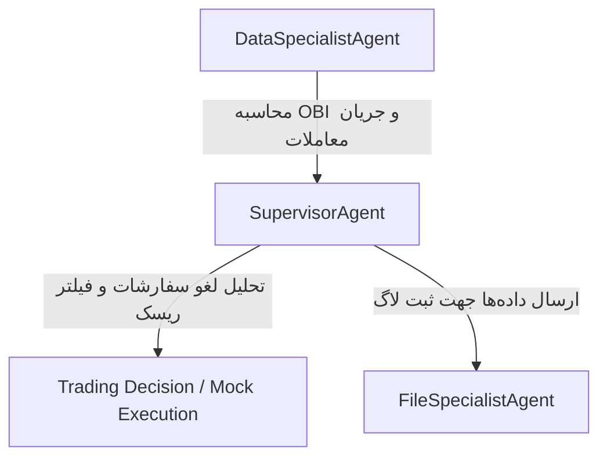

# 🤖 ربات معاملاتی چند عامله ROBOCHILD

پروژه **ROBOCHILD** یک سیستم معاملاتی الگوریتمی پیشرفته مبتنی بر یادگیری تقویت‌شده (Reinforcement Learning) و معماری هوشمند چند عامله (Multi-Agent System) است. این ربات با واکشی بلادرنگ داده‌های دفترچه سفارشات (L2 Order Book) و معاملات مارکت (Trades Stream)، دیوارهای فرضی خریدار/فروشنده را پایش کرده و با فیلتر هوشمند سفارش‌های فریبنده (Spoofing Detection)، سیگنال‌های تایید شده صادر می‌کند.

---

## 🏗️ معماری سیستم عامل‌ها (Multi-Agent Architecture)

پروژه ROBOCHILD از **الگوی ناظر (Supervisor Pattern)** بر اساس استانداردهای مهارت توسعه عامل‌ها بهره می‌گیرد:



1. **عامل متخصص داده (`DataSpecialistAgent`):** وظیفه برقراری ارتباط با WebSocket صرافی، محاسبه شاخص عدم تعادل دفترچه سفارشات (OBI) و تجمیع حجم خرید/فروش مارکت در پنجره‌های ۱۰ ثانیه‌ای را دارد.
2. **عامل متخصص لاگ‌نویسی (`FileSpecialistAgent`):** به صورت ناهمگام (Non-blocking) تاریخچه دقیق سیگنال‌ها و تراکنش‌های انجام شده را روی فایل‌های ساختار یافته دیسک ذخیره می‌کند.
3. **عامل ناظر کل (`SupervisorAgent`):** هماهنگ‌کننده اصلی سیستم، تحلیل‌گر لغو سفارشات سنگین (Spoofing) و کنترل‌کننده ریسک نهایی است که در صورت صحت شرایط، دستور ورود به موقعیت معاملاتی را صادر می‌کند.

---

## 📂 ساختار پوشه‌های پروژه

```text
├── .gemini/                 # پوشه مهارت‌های هوش مصنوعی تزریق شده به پروژه
├── src/
│   ├── agents/              # پیاده‌سازی کلاس‌های عامل‌ها (تحت asyncio)
│   │   ├── base.py
│   │   ├── data_specialist.py
│   │   ├── file_specialist.py
│   │   └── supervisor.py
│   ├── analysis/            # ابزار ارزیابی کیفیت آموزش مدل‌ها
│   │   └── training_evaluator.py
│   ├── core/                # داشبورد مدیریت و سرور کنترلی
│   └── env/                 # محیط‌های شبیه‌ساز معاملاتی و واکشی داده
├── scratch/                 # فایل‌های شبیه‌سازی و تست موقت
│   ├── test_agents.py       # سناریوی شبیه‌سازی اجرای ۳ عامل با صرافی شبیه‌سازی شده
│   └── trading_tools_desc.json
├── bot_hybrid_trades_lob.py # ربات سنتی مبتنی بر قانون (Rule-based)
├── validate_pipeline.py     # تست انتهای به انتهای خط لوله آموزش
└── requirements.txt         # لیست پیش‌نیازهای پروژه
```

---

## ⚡ راهنمای نصب و راه‌اندازی سریع

### ۱. پیش‌نیازها
مطمئن شوید پایتون نسخه **3.10** یا بالاتر روی سیستم شما نصب است.

### ۲. نصب بسته‌های مورد نیاز
دستور زیر را در ترمینال یا خط فرمان اجرا کنید تا کتابخانه‌ها نصب شوند:
```bash
pip install -r requirements.txt
pip install aiofiles
```

### ۳. اجرای شبیه‌سازی سیستم چند عامله (تست صحت عملکرد)
جهت اجرای شبیه‌ساز ناهمگام و صحت‌سنجی ارتباطات عامل‌ها، دستور زیر را اجرا کنید:
```bash
python -m scratch.test_agents
```
این دستور صرافی شبیه‌سازی شده ایجاد کرده و عامل داده و ناظر را به چالش می‌کشد تا دیوارهای Spoofing را به صورت شبیه‌سازی شده شناسایی کنند.

### ۴. اجرای اعتبارسنجی خط لوله آموزش مدل‌ها
برای بررسی عملکرد صحیح بخش مدل‌های شبکه عصبی پروژه:
```bash
python validate_pipeline.py
```

---

## 🛡️ ممیزی‌های کیفیت و استانداردهای توسعه
این پروژه مجهز به مهارت‌های زیر است:
* **`agent-designer`:** الگوهای طراحی ماژولار عامل‌ها و شمای ابزارها.
* **`senior-fullstack`:** بررسی مداوم کیفیت کد، امنیت SQL Injection و پیچیدگی توابع.

جهت بررسی کیفیت ساختار کد می‌توانید دستور زیر را اجرا کنید:
```bash
python .gemini/skills/senior-fullstack/scripts/code_quality_analyzer.py . --verbose
```
